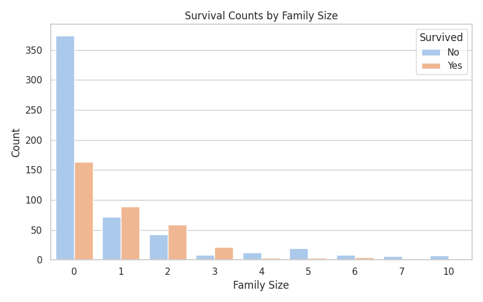

# titanic-classification
classifying if someone died or survived the Titanic Disaster aswell as EDA on the dataset

## Gender vs Survival

## Passenger Class vs Survival

## Age Distribution by Survival

## Family size vs Survival

